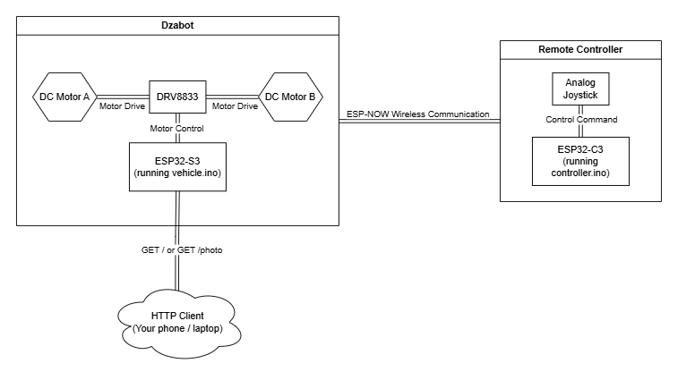
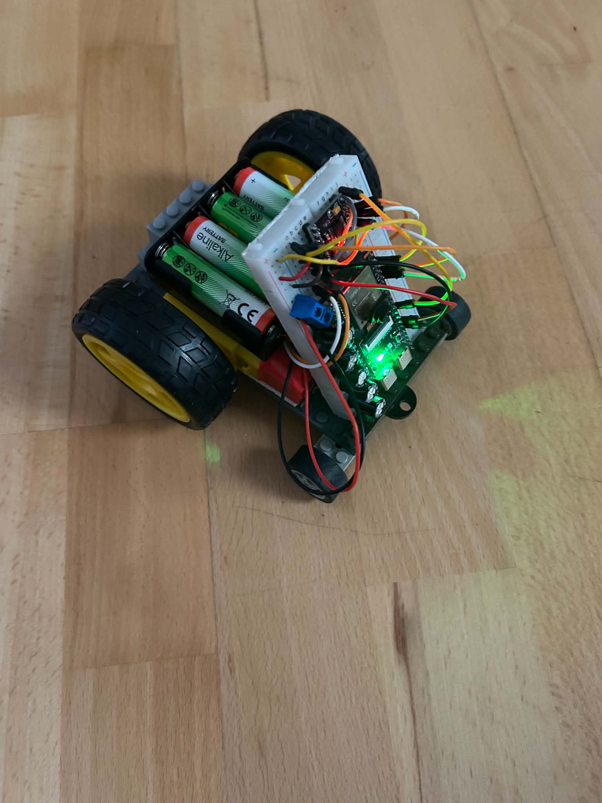
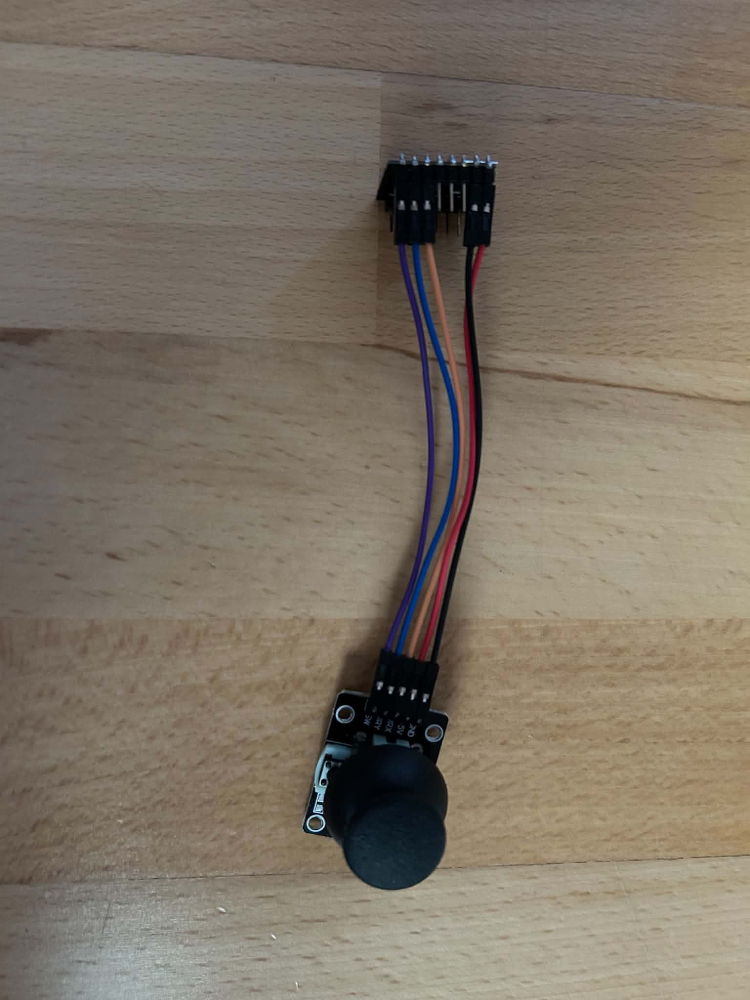

# Dzabot - Mobile Robot with Remote Control

This repository contains a firmware for my hand-crafted robot together with the controller.

## Components

| Component | Purpose |
|---|---|
| ESP32-S3 with OV5640 camera module | Main computing unit on the robot |
| DRV8833 motor driver | Controlling 2 DC motors (rear-wheel drive) |
| 5x electrolytic capacitor 100µF | Smoothing out the WiFi transmission current requirements |
| 4x 1.5V batteries + battery pack | Power supply for both the MCU and driver |
| Analog joystick | Input device for the robot control |
| ESP32-C3 | Computing unit in the wireless controller |
| Jumper wires + solderless breadboard | Wiring and physical/electrical connections between the components |

## Software Libraries

I used Arduino Core libraries and related compilers to create the firmware for both the robot and controller.

Specific included libraries:

- `esp_now.h`
- `esp_wifi.h`
- `Wifi.h`
- `WebServer.h`
- `esp_camera.h`
- `WiFiClientSecure.h`
- `HTTPClient.h`
- `camera_pin_config.hpp`

## Functionality

The robot MCU (ESP32-S3) communicates with the controller MCU (ESP32-C3) via ESP-NOW protocol (based on WiFi physical stack). Moreover, the robot MCU has a server (on it's own access point - you need to connect with your client device to it) listening at `http://192.168.4.1/` which on `GET /` or `GET /photo` request captures a photo with the camera and serves it to the client.

## Abstract Schematic

## Photo(s)

### Robot

### Controller

